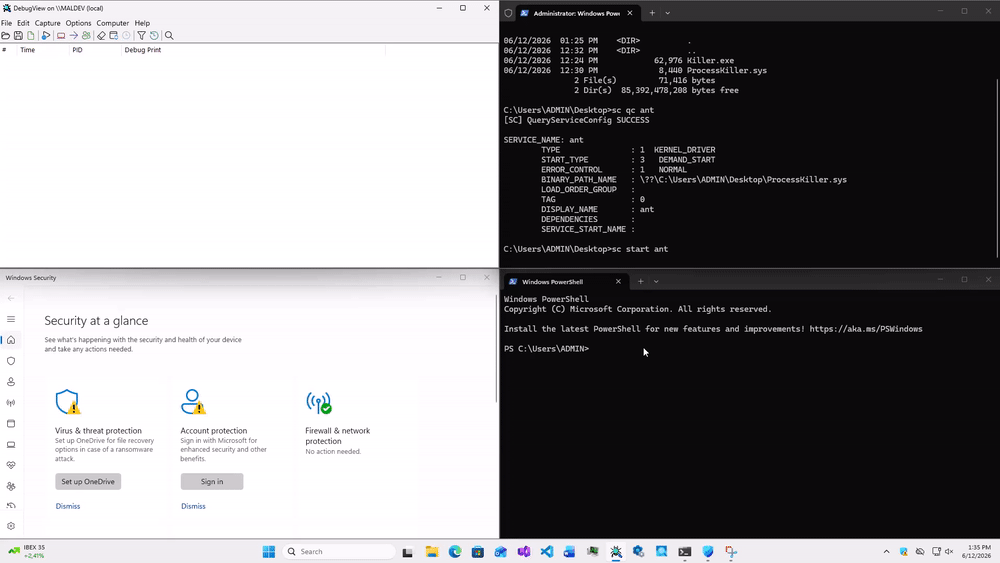

# ProcessKiller.sys

Kernel-mode driver developed to demonstrate driver initialization, device creation, and dispatch routine registration. The driver exposes a device object that is accessible from user mode, allowing applications to communicate with the driver through `IOCTL` requests.

As a proof-of-concept, the driver accepts a process identifier (PID) from user mode and uses the `ZwTerminateProcess` kernel API to terminate the specified process from kernel mode. This project illustrates basic user-to-kernel communication, `IOCTL` handling, and process management operations within a Windows kernel driver.

