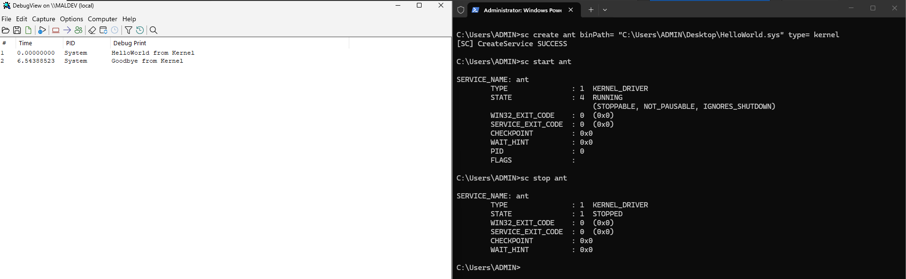

# Kernel Driver Development

This repo includes some basic kernel drivers developed for learning purposes.
Current goals:

- Understand Driver Skeleton (Calling convention, Important Stuctures, etc.)
- Master BYOVD
- Read about Reflective Driver Injection (projects like kdmapper)

##  Driver Structure

### Building our First Driver (HelloWorld.sys)

**Entry Point** calling convention:

```c
#include <ntddk.h>

NTSTATUS DriverEntry(IN PDRIVER_OBJECT DriverObject, IN PUNICODE_STRING RegistryPath)
{
    NTSTATUS STATUS = STATUS_SUCCESS;
    
    // initialization code

    return STATUS;
}
```

The `DriverEntry` is the standard entry point for windows Kernel Drivers. This function is in charge of initializing the DriverObject (`DRIVER_OBJECT`). This includes setting up all desired callbacks, dispatching routines, etc. 
Lastly, this function should return an `NTSTATUS` value.

If we were to attempt to compile the previous snippet on Visual Studio 2026, we would get a warning preventing the final build.

- *Remarks*: With Kernel Driver Development, any Warning is treated as an Error, this behaviour can be overriden or disabled although it is not recommended.

The warning is raised because `DriverObject` and `RegistryPath` are declared within the driver's entry point but never used. The `UNREFERENCED_PARAMETER()` macro can be used in these situations to explicitly mark these parameters as unused and suppress the compiler warning:

```c
#include <ntddk.h>

NTSTATUS DriverEntry(IN PDRIVER_OBJECT DriverObject, IN PUNICODE_STRING RegistryPath)
{
    NTSTATUS STATUS = STATUS_SUCCESS;
    
    UNREFERENCED_PARAMETER(DriverObject);
    UNREFERENCED_PARAMETER(RegistryPath);

    KdPrint(("[+] Hello World From the Kernel!\n"));

    return STATUS;
}
```

Our initial basic driver (HelloWorld.sys) is now complete. After disabling the driver-signing policy, one can load the driver using the Service Configuration built-in tool `sc.exe`, and view the kernel traces with [`DebugView.exe`](https://learn.microsoft.com/es-es/sysinternals/downloads/debugview) from sysinternals.

**Unload** routine:

Attempting to stop the previous kernel driver will fail. This is because we have not declared the Unload routine.

- `PDRIVER_OBJECT->DriverUnload`: The *entry point for the driver's Unload routine*, if any, which is set by the `DriverEntry` routine when the driver initializes. If a driver has no Unload routine, this member is `NULL`.

```c
#include <ntddk.h>

void Unload(IN PDRIVER_OBJECT DriverObject)
{
    UNREFERENCED_PARAMETER(DriverObject);
    KdPrint(("[+] Goodbye from Kernel\n"));
}


NTSTATUS DriverEntry(IN PDRIVER_OBJECT DriverObject, IN PUNICODE_STRING RegistryPath)
{
   // initialization

    DeviceObject->DriverUnload = Unload;
    return STATUS;
}
```
- *Remarks*: The Unload routine must return `VOID` and by calling convention it receives the `DEVICE_OBJECT` object.



### Interacting with a Driver from User-Land (ProcessKiller.sys)

User-Land programs can interact with Kernel Mode Drivers via "device" objects. These devices must be registered and later exposed via SymLink creation:

- `IoCreateDevice`: The IoCreateDevice routine creates a device object for use by a driver.
- `IoCreateSymbolicLink`: The IoCreateSymbolicLink routine sets up a symbolic link between a device object name and a user-visible name for the device.

*"The other important set of operations to initialize is called Dispatch Routines. This is an array of function pointers, in the MajorFunction member of `DRIVER_OBJECT`."* This routines define which kind of operations are supported by the Driver.

We will start by covering the following:

- `IRP_MJ_CREATE`: Allows opening a handle to a driver's device object.
- `IRP_MJ_CLOSE`: Allows closing a handle to a driver's device object.
- `IRP_MJ_DEVICE_CONTROL`: Processes device-specific I/O control requests issued by user-mode applications via the `DeviceIoControl` Win32 API.

The aforementioned Major Functions have the following interface:

```c
NTSTATUS DeviceCreateClose(IN PDEVICE_OBJECT DeviceObject, IN PIRP Irp);

NTSTATUS DeviceControl(IN PDEVICE_OBJECT DeviceObject, IN PIRP Irp);
```

One can now take a look at how the MajorFunction array member's can be initialized:

```c
NTSTATUS DriverEntry(PDRIVER_OBJECT DriverObject, PUNICODE_STRING RegistryPath)
{
    
    NTSTATUS STATUS = STATUS_SUCCESS;
    UNREFERENCED_PARAMETER(RegistryPath);

    DriverObject->DriverUnload = Unload;
    DriverObject->MajorFunction[IRP_MJ_CREATE] = DeviceCreateClose;
    DriverObject->MajorFunction[IRP_MJ_CLOSE] = DeviceCreateClose;
    DriverObject->MajorFunction[IRP_MJ_DEVICE_CONTROL] = DeviceControl;

    PDEVICE_OBJECT DeviceObject;
    UNICODE_STRING DeviceName = RTL_CONSTANT_STRING(L"\\Device\\ProcessKiller");
    UNICODE_STRING SymLink = RTL_CONSTANT_STRING(L"\\??\\ProcessKiller");

    STATUS = IoCreateDevice(
	    DriverObject,   // (IN PDRIVER_OBJECT) Pointer to the driver object for the caller
	    0, // DeviceExtensionSize
    	&DeviceName, // (IN PUNICODE_STRING) buffer containing a null-terminated Unicode string that names the device object
    	FILE_DEVICE_UNKNOWN, // (IN DEVICE_TYPE) DeviceType
	    0, // (IN ULONG) DeviceCharacteristics
    	FALSE, // (IN BOOLEAN) Exclusive
    	&DeviceObject // (OUT PDEVICE_OBJECT) Pointer to a variable that receives a pointer to the newly created DeviceObject
        );

    if (!NT_SUCCESS(STATUS))
    {
	    KdPrint(("[!] IoCreateDevice failed with error code: 0x%0.8X\n", STATUS));
    	return STATUS;
    }


    STATUS = IoCreateSymbolicLink(
	    &SymLink, // (IN PUNICODE_STRING) SymbolicLinkName
	    &DeviceName); // (IN PUNICODE_STRING) DeviceName

    if (!NT_SUCCESS(STATUS))
    {
	    KdPrint(("[!] IoCreateSymbolicLink failed with error code: 0x%0.8X\n", STATUS));
        // in Kernel Development we need to handle correctly all exceptions to avoid BSODs and memory leaks...
    	IoDeleteDevice(DeviceObject);
	    return STATUS;
    }

    KdPrint(("[+] Created Device with symlink: \\??\\ProcessKiller\n"));
    return STATUS;
}
```

Once a driver's device has been properly exposed and initialized, a program from UserMode can use the following Win32 APIs for interaction:

- `CreateFile`: Opening a handle to a device object.
- `CloseHandle`: Closing a handle to a device object.
- `DeviceIoControl`: Generic mechanism for passing data to and from the driver.

```c
int main(int argc, char* argv[])
{
	if (argc != 2)
	{
		printf("[!] Usage: %s <PID 2 Kill>\n", argv[0]);
		return EXIT_FAILURE;
	}

	ULONG PID = (ULONG)atoi(argv[1]);

	printf("[+] Tasked to kill Process with PID: %lu\n", PID);

	HANDLE hDevice = CreateFileA(
		"\\\\.\\ProcessKiller", // symlink to our device object
		GENERIC_WRITE,
		FILE_SHARE_WRITE,
		NULL,
		OPEN_EXISTING,
		0,
		NULL
	);

	if (hDevice == INVALID_HANDLE_VALUE)
	{
		printf("[!] CreateFileA failed with error code: %d\n", GetLastError());
		return EXIT_FAILURE;
	}

	DWORD dwBytesReturned;

	if (!DeviceIoControl(
		hDevice,
		IOCTL_PROCESS_KILLER, // IOCTL Explained On Upcomming Sections
		&PID,
		sizeof(ULONG),
		NULL,
		0,
		&dwBytesReturned,
		NULL))
	{
		printf("[!] DeviceIoControl failed with error code: %d\n", GetLastError());
		CloseHandle(hDevice);
		return EXIT_FAILURE;
	}

	CloseHandle(hDevice);
	printf("[+] SUCCESS!\n");
	return EXIT_SUCCESS;

}
```

The previous `C` code sends a user-supplied PID (Process ID) to `ProcessKiller.sys`, which then terminates the corresponding process. This capability can be abused to kill EDR and antivirus processes, an action that is significantly more difficult from user mode because such security-critical processes are often protected by mechanisms such as Protected Process Light (PPL).

From `ProcessKiller.sys` we now need to define the logic of our Dispatch Routines to achive such task.

Let's start with the `IRP_MJ_OPEN` and `IRP_MJ_CLOSE` routines. These functions are responsible for handling the driver's device `HANDLE` creation and deletion.

```c
NTSTATUS DeviceCreateClose(IN PDEVICE_OBJECT DeviceObject, IN PIRP Irp)
{
	UNREFERENCED_PARAMETER(DeviceObject);

	Irp->IoStatus.Status = STATUS_SUCCESS;
	Irp->IoStatus.Information = 0;
	IoCompleteRequest(Irp, IO_NO_INCREMENT);

	return STATUS_SUCCESS;

}
```
The `IRP` (I/O Request Packet) is the structure used to communicate between the various components involved in an I/O operation. For `IRP_MJ_CREATE` and `IRP_MJ_CLOSE` requests, no special processing is required in our driver, so the routine simply sets IoStatus.Status to `STATUS_SUCCESS` and IoStatus.Information to 0, indicating that the operation completed successfully and no additional data is being returned. The request is then completed by calling `IoCompleteRequest()`, which notifies the I/O Manager that the IRP has finished processing. Finally, the dispatch routine returns `STATUS_SUCCESS` to indicate that the request was handled without errors.


----
### References

- Windows Kernel Programming (author Pavel Yosifovich)
- [Ido Veltzman Blog](https://idov31.github.io/posts/lord-of-the-ring0-p1)
- [Kernel Access Please – BYOVD and Vulnerable Drivers](https://www.nsideattacklogic.de/en/kernel-access-please-byovd-and-vulnerable-drivers/)
